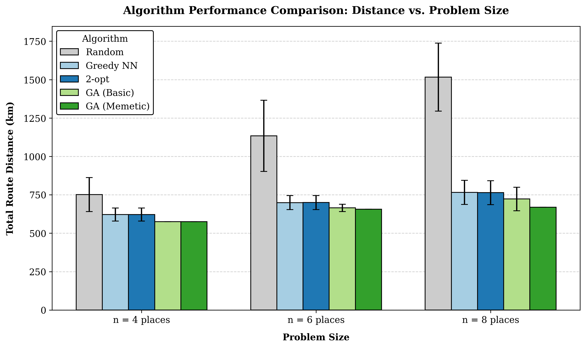
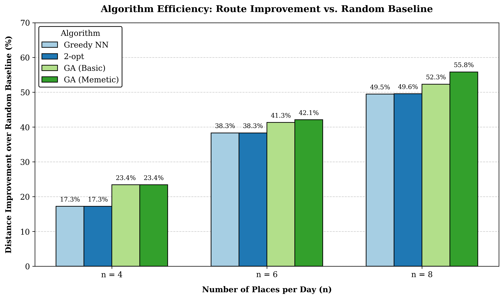
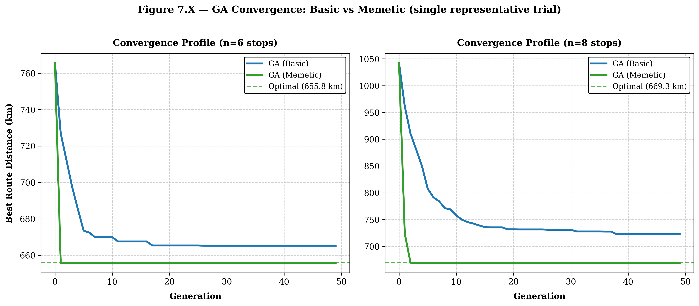

<div align="center">

# Sak Tmor — AI-Powered Multi-Day Trip Planner for Cambodia

**Implementing Genetic Algorithms for Personalized Multi-Day Trip Planning**

A research-grade system that joins content-based recommendation with metaheuristic route optimization to generate geographically coherent, personalized itineraries across Cambodia.

[](https://www.python.org/)
[](https://fastapi.tiangolo.com/)
[](https://vuejs.org/)
[](https://scikit-learn.org/)
[](https://leafletjs.com/)
[](./LICENSE)


</div>

---

## Abstract

Tourists planning a multi-day trip face two coupled problems: deciding *what* to visit among thousands of candidate places, and deciding *how* to order those visits across days without wasting hours in transit. Most published trip-planning work solves only one half either recommendation with no routing, or single-day route optimization with no quality model.

Sak Tmor tackles both. It collects and merges 4,069 Cambodian places from three independent sources, scores each one with a tuned rating/review/authenticity model, and then runs a **memetic genetic algorithm** (GA hybridized with 2-opt local search) to lay out an efficient multi-day route. A user-controllable *planning philosophy* (`adventure` / `balanced` / `chill`) trades route efficiency against logistical simplicity.

On benchmark instances for Siem Reap, the memetic GA produces routes **39.3% shorter than a random baseline** and **15.0% shorter than deterministic 2-opt** (Wilcoxon signed-rank, *p* = 1.8 × 10⁻⁵), while staying well within interactive latency.

---

## Table of Contents

- [System Overview](#system-overview)
- [Dataset](#dataset)
- [Methodology](#methodology)
  - [Scoring Model](#1-scoring-model)
  - [Geographic Clustering](#2-geographic-clustering)
  - [Memetic Genetic Algorithm](#3-memetic-genetic-algorithm)
- [Results](#results)
- [Evaluation Framework](#evaluation-framework)
- [Running Locally](#running-locally)
- [Repository Structure](#repository-structure)
- [Roadmap](#roadmap)
- [Related Work](#related-work)
- [Author](#author)

---

## System Overview

The system splits into three stages: an offline **data pipeline**, an online **optimization backend**, and an interactive **frontend**.

<div align="center">



</div>

| Layer | Stack | Responsibility |
|-------|-------|----------------|
| Pipeline | Python, pandas, scikit-learn | Collect, merge, clean, train TF-IDF + label encoders, tune weights |
| Backend | FastAPI, NumPy, scikit-learn | Recommendation scoring, KMeans clustering, genetic route optimization |
| Frontend | Vue 3, Vite, Leaflet | Multi-step planning form, interactive map, per-day itinerary view |

---

## Dataset

I built the corpus by merging three sources with an outer join, then deduplicating on `(title, province)` so that same-named places in different provinces no longer collide.

| Property | Value |
|----------|------:|
| Places (post-clean) | **4,069** |
| Features per place | **53** |
| Provinces covered | **25** |
| Primary sources | HERE Places API, TripAdvisor, tourismcambodia.org |

Each place carries coordinates, category labels, rating, review count, and free-text description. Coordinates feed the router; ratings, reviews, and descriptions feed the scorer.

---

## Methodology

### 1. Scoring Model

Every candidate place receives a composite score that balances popularity signals against content relevance:

```
final_score   = weighted_score + (tfidf_similarity × 2.0)
weighted_score = (rating × w_rating) + (log(reviews + 1) × w_review)
```

I tune `w_rating` and `w_review` with an AUC grid search (`pipeline/training/tune_weights.py`) rather than hand-picking them. Null handling matters: a missing rating falls back to the dataset median instead of zero, and a missing review count contributes nothing instead of zeroing the whole score.

A separate **authenticity signal** flags hidden gems — places that locals favor but that mass tourism overlooks:

```
local_favored_score = (khmer_signal × 0.3) + (keyword_signal × 0.3) + (popularity_signal × 0.4)
is_hidden_gem       = local_favored_score ≥ 0.5
```

### 2. Geographic Clustering

A naive itinerary can send a traveler north on Day 1 and south on Day 2. To prevent that, KMeans partitions each request's candidate activities into spatial zones, and the day sequence follows a nearest-neighbor path across the zone centroids. The number of zones depends on the chosen planning mode.

| Mode | Zones | Hotel changes | Activities/day | Intent |
|------|-------|---------------|---------------|--------|
| `adventure` | `n_days` | daily | +20% | Maximize variety, a new base each day |
| `balanced` | `ceil(n_days/2)` | every 2 days | normal | Efficiency with coherent flow |
| `chill` | 1 | never | −20% | Minimal logistics, single base |

### 3. Memetic Genetic Algorithm

Route ordering within and across days is a Traveling-Salesman-style problem. I model it with a genetic algorithm and then hybridize it into a **memetic algorithm** — every child produced by crossover and mutation is polished with 2-opt local search before it competes. The implementation adds three research-grade refinements over a textbook GA:

- **Adaptive mutation rate** — driven by population diversity (coefficient of variation of fitness). High diversity → more exploration; converging population → more exploitation. Replaces a fixed mutation constant.
- **Multi-operator bandit** — three mutation operators (swap, inversion, insertion) selected by an ε-greedy bandit that tracks each operator's recent improvement rate.
- **Cross-day global encoding** — `_optimize_trip_global()` encodes the whole trip as one permutation chromosome that jointly performs *selection*, *day-assignment*, and *rough ordering*, then per-day 2-opt polishes the result. This replaced standalone KMeans assignment and cut the Siem Reap worst-day distance from ~127 km to ~25 km.

I validated the optimizer against four baselines (Random, Greedy nearest-neighbor, 2-opt, basic GA) over 30 trials per problem size with a Wilcoxon signed-rank significance test.

---

## Results

All results below come from `pipeline/benchmarks/` on Siem Reap instances, 30 trials each. Reproduce them with the commands in [Running Locally](#running-locally).

### Route quality scales with problem size

As the number of stops per day grows, the gap between the genetic algorithms and the simpler heuristics widens — exactly where good optimization matters most.

<div align="center">



</div>

### Improvement over a random baseline

The memetic GA reaches a **55.8% distance reduction** over the random baseline at n = 8, ahead of every other method tested.

<div align="center">



</div>

### Convergence behavior

The memetic hybrid collapses onto a near-optimal route within the first one or two generations, while the basic GA needs ~20 generations and still settles higher.

<div align="center">



</div>

### Headline numbers (Siem Reap, n = 8, 30 trials)

| Algorithm | Mean distance (km) | Std (km) | Mean time (ms) |
|-----------|-------------------:|---------:|---------------:|
| Random | 30.04 | 3.07 | 0.07 |
| Greedy NN | 23.65 | 1.82 | 0.08 |
| 2-opt | 21.44 | 1.78 | 0.61 |
| GA (basic) | 18.50 | 0.63 | 61.75 |
| **GA (memetic)** | **18.23** | **0.00** | 180.72 |

**Significance tests**

| Comparison | Improvement | Wilcoxon *p* | Winner |
|------------|------------:|-------------:|--------|
| Memetic GA vs Random | 39.3% | — | Memetic GA |
| Memetic GA vs 2-opt | 15.0% | 1.8 × 10⁻⁵ | Memetic GA |
| Memetic GA vs Basic GA | 1.5% | 3.8 × 10⁻² | Memetic GA |

### System latency (50 live requests)

| Metric | p50 | p95 | p99 |
|--------|----:|----:|----:|
| Latency (ms) | 884 | 1,337 | 1,949 |

Median response stays under one second — interactive for a planning UI. The tail (p99) is a known target for the caching work on the roadmap.

---

## Evaluation Framework

Beyond route length, I measure recommendation quality with offline metrics that need no user data (`pipeline/benchmarks/evaluate_itinerary_quality.py`):

| Metric | What it captures |
|--------|------------------|
| Category diversity (entropy) | Whether a day mixes experience types or repeats one |
| Spatial efficiency (km/place) | Travel cost per place actually visited |
| Score density | Average weighted score of recommended places |
| Hidden-gem rate | Share of recommendations flagged as authentic/local |
| Coverage | Share of a province's places ever surfaced across many trips |

On a 50-trip Siem Reap sample, coverage reached **47.6%** and mean score density **2.83**, with spatial efficiency averaging **6.08 km per activity**. These baselines drive the diversity-aware sampling work on the roadmap.

---

## Running Locally

### Backend (FastAPI)

```bash
cd backend
pip install -r requirements.txt
uvicorn api:app --reload --port 8000
```

### Frontend (Vue 3 + Vite)

```bash
cd frontend
npm install
npm run dev      # proxies /api → http://localhost:8000
```

### Reproduce the benchmarks

```bash
# Route-optimization benchmark (Random / Greedy NN / 2-opt / GA / memetic GA)
python pipeline/benchmarks/ga_benchmark.py --province "Siem Reap" --n 8 --trials 30 --save

# Itinerary quality + latency (backend must be running)
python pipeline/benchmarks/evaluate_itinerary_quality.py --province "Siem Reap" --trips 50
python pipeline/benchmarks/latency_benchmark.py --province "Siem Reap" --requests 50
```

> The dataset and trained models ship with the repo, so the pipeline only needs re-running to refresh place data. Restarting the backend picks up `api.py` changes immediately.

---

## Repository Structure

```
sak-tmor/
├── backend/
│   ├── api.py                 # FastAPI app — scoring, clustering, GA (single source of truth)
│   ├── data/                  # cleaned_merged_data.csv (live data)
│   └── model/                 # TF-IDF models, label encoders, tuned weights.json
├── frontend/                  # Vue 3 + Vite + Leaflet planner
├── pipeline/
│   ├── collection/            # HERE / TripAdvisor / scraper collectors
│   ├── cleaning/              # merge + clean
│   ├── training/              # TF-IDF training + weight tuning
│   └── benchmarks/            # GA, quality, latency benchmarks + results
├── research/
│   ├── EXPERIMENT_LOG.md      # dated, artifact-backed findings log
│   └── notebook/              # EDA + result charts (.ipynb, .png)
├── THESIS_REPORT.md           # full research write-up
└── docker-compose.yml
```

---

## Roadmap

Completed and planned work, tracked in detail in [`THESIS_REPORT.md`](./THESIS_REPORT.md).

- [x] Multi-source collection, cleaning, and TF-IDF training pipeline
- [x] Weighted scoring with tuned rating/review weights and hidden-gem signal
- [x] Geographic clustering and per-day routing
- [x] Memetic GA: 2-opt polish, adaptive mutation, multi-operator bandit
- [x] Cross-day global GA encoding (joint selection + assignment + routing)
- [x] Time-window-aware (VRPTW) day-level penalties
- [x] Benchmark suite with statistical testing and convergence analysis
- [ ] Bayesian-average rating to replace the AUC weight-tuning proxy
- [ ] Sentence-embedding description similarity (multilingual, Khmer-aware)
- [ ] NSGA-II multi-objective Pareto front (distance ↔ score ↔ diversity ↔ authenticity)
- [ ] Request caching and rate limiting for public deployment

---

## Related Work

This project sits at the intersection of three lines of research, and contributes by combining them:

- **TSP / VRP metaheuristics** — genetic algorithms, 2-opt, and memetic hybrids for route optimization. Sak Tmor adds adaptive operators and a cross-day global encoding.
- **Vehicle Routing with Time Windows (VRPTW)** — opening-hour constraints folded into the GA fitness.
- **Tourist trip recommendation** — most prior systems recommend places *or* route a single day; this work unifies multi-day recommendation and routing under a user-controlled planning philosophy.

---

## Author

**Sopanha Lay** — Cambodia Academy of Digital Technology (CADT)

Built during an internship research track. The system, benchmarks, and write-up form the foundation for continued work in optimization and applied machine learning.

---

<div align="center">
<sub>Licensed under the <a href="./LICENSE">MIT License</a>.</sub>
</div>
